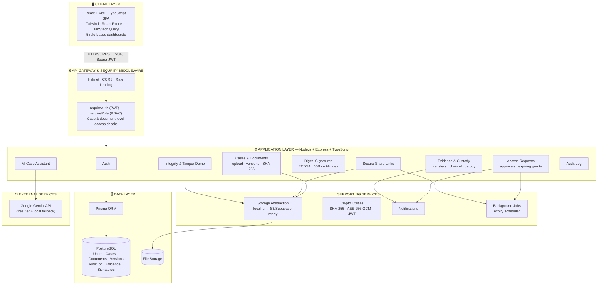

<div align="center">

# 🛡️ NyayaVault

### Secure Digital Document Management System for Legal & Investigation Documents

**Smart India Hackathon 2026 — Problem Statement SIH26190**

[](https://nodejs.org)
[](https://www.typescriptlang.org)
[](https://react.dev)
[](https://www.postgresql.org)
[](https://www.prisma.io)
[]()

</div>

---

## ⚠️ Data Disclaimer

Every case, user, document, and evidence item in this repository is **synthetic and fictional**, created solely for demonstration. No real investigation, legal, or personal data is used anywhere in this project. See [`docs/DEMO.md`](docs/DEMO.md).

NyayaVault does **not** claim to be hack-proof, 100% tamper-proof, automatically legally admissible, or integrated with any real government/police system. It is a working prototype demonstrating the architecture and workflows such a system would need.

---

## 📌 The Problem

India's courts are sitting on **5.4 crore (54 million) pending cases**, over 85% of them in district and subordinate courts — exactly where investigation evidence lives day to day *(National Judicial Data Grid, 2025)*. Investigation and legal documents routinely move through email threads, WhatsApp, and shared drives with no way to prove a document hasn't been altered, no record of who accessed what, and no control over who can see sensitive evidence. Indian law already requires certification for digital evidence to be admissible in court (Section 65B, Indian Evidence Act / Bharatiya Sakshya Adhiniyam 2023) — yet most teams handling that evidence have no system that produces this automatically.

## 💡 The Solution

**NyayaVault** is a secure, investigation-document lifecycle platform built around three pillars:

| Pillar | What it does |
|---|---|
| 🔐 **Trust** | SHA-256 hashing on every upload, integrity verification, permanent version history, prototype digital signatures with Section 65B-style certificates |
| 🛂 **Control** | JWT authentication, backend-enforced RBAC across 5 roles, document-level access grants with expiry, secure time-limited share links |
| 🧠 **Intelligence** | AI case assistant for summarization, entity extraction, and cross-document search — strictly scoped to documents the requesting user is already authorized to see |

It is a fully working system — real database, real authentication, real backend authorization — not a static UI mockup.

---

## 🏗️ System Architecture



- **Client** — React 18 + Vite + TypeScript SPA (Tailwind, React Router, TanStack Query, Zod), with 5 distinct role-based dashboards
- **API Gateway & Security Middleware** — Helmet, CORS, rate limiting, JWT verification (`requireAuth`), RBAC enforcement (`requireRole`), and case/document-level access checks — enforced on the server for every request, never just hidden in the UI
- **Application Layer** — Node.js + Express + TypeScript, organized into modules: Auth, Cases & Documents, Access Requests, Evidence & Custody, Digital Signatures, Integrity & Tamper Demo, Secure Share Links, AI Case Assistant, Audit Log
- **Supporting Services** — storage abstraction (local filesystem today, S3/Supabase-ready), crypto utilities (SHA-256, AES-256-GCM, JWT), notifications, background expiry jobs
- **Data Layer** — Prisma ORM over PostgreSQL, plus file storage for uploaded document bytes
- **External Services** — Google Gemini API (free tier, with a local fallback provider) for the AI Case Assistant

Full breakdown in [`docs/ARCHITECTURE.md`](docs/ARCHITECTURE.md).

---

## 👥 Roles & Dashboards

Each role gets a genuinely different dashboard and a different set of backend permissions — calling a restricted API directly (bypassing the UI entirely) returns `403`, not just a hidden button.

| Role | Dashboard focus |
|---|---|
| **Admin** | Users, active cases, security alerts, audit activity, pending approvals |
| **Investigating Officer** | Assigned cases, recent documents, uploads, access requests, AI case assistant |
| **Senior Officer** | Supervised cases, pending approvals, integrity alerts, signatures, audit activity |
| **Forensic Officer** | Assigned evidence, forensic reports, chain of custody, integrity checks |
| **Legal Officer** | Assigned cases, legal documents, documents awaiting review, signatures |

---

## 🔑 Core Features

- **Document lifecycle** — upload → SHA-256 hash → version history (old versions never overwritten) → integrity verification
- **Chain of custody** — a full, auditable timeline for every document and evidence item, built from an immutable audit log
- **Access requests & approvals** — restricted/confidential documents require an explicit, time-bound grant even from case members; Senior Officers/Admins approve or reject with a set expiry
- **Evidence custody transfers** — logged hand-offs between officers, each with a receipt
- **Prototype digital signatures** — ECDSA signing with Section 65B-style certificate drafts, clearly labeled as a prototype, not a legal certification
- **Tamper simulation** — a safe, clearly labeled demo feature that intentionally corrupts a stored file so integrity verification can catch and flag the mismatch
- **Secure share links** — expiring, download-limited, hash-re-verified before every download; reveal no internal storage path
- **AI Case Assistant** — case/document summarization, entity extraction, and cross-document Q&A, authorization-checked *before* any document reaches the AI provider
- **Full audit log** — filterable by user, case, action, and date

---

## 🧰 Tech Stack

| Layer | Technology |
|---|---|
| Frontend | React, Vite, TypeScript, Tailwind CSS, React Router, TanStack Query, Zod, Lucide |
| Backend | Node.js, Express, TypeScript |
| Database | PostgreSQL + Prisma ORM |
| Auth | JWT (access + refresh tokens), Argon2 password hashing |
| Storage | Local filesystem (dev), abstracted for future S3 / Supabase |
| AI | Google Gemini API (free tier) with a local fallback provider |
| Security | Helmet, CORS, rate limiting, Zod validation, backend RBAC |

---

## 🚀 Getting Started

### Prerequisites
- Node.js 20+
- PostgreSQL 14+

### Setup

```bash
# 1. Install dependencies
npm install

# 2. Configure environment
cp .env.example apps/api/.env
# edit apps/api/.env and set DATABASE_URL to your Postgres instance

# 3. Set up the database
npm run prisma:generate
npm run prisma:migrate

# 4. Seed demo data
npm run seed

# 5. Run the API (terminal 1)
npm run dev:api

# 6. Run the web app (terminal 2)
npm run dev:web
```

Open **http://localhost:5173**.

### Demo Accounts
Password for all accounts: `Demo@1234`

| Role | Email |
|---|---|
| Admin | admin@nyayavault.demo |
| Investigating Officer | officer@nyayavault.demo |
| Senior Officer | senior@nyayavault.demo |
| Forensic Officer | forensic@nyayavault.demo |
| Legal Officer | legal@nyayavault.demo |

Full setup + verification checklist in [`README-SETUP.md`](README-SETUP.md) *(or see `docs/` for phase-by-phase guides)*.

---

## 📁 Project Structure

```
nyayavault/
  apps/
    api/            Express + TypeScript + Prisma backend
    web/            React + Vite + TypeScript frontend
  packages/
    shared/         Cross-app shared types
  docs/
    architecture.png       System architecture diagram (embedded above)
    ARCHITECTURE.md        Detailed architecture notes
    SECURITY.md            Security model & known limitations
    API.md                 API reference
    DEMO.md                Demo data & walkthrough script
  .env.example
```

---

## 🔒 Security Notes

- Passwords hashed with Argon2, never logged in plaintext
- Short-lived JWT access tokens + revocable, DB-backed refresh tokens
- RBAC enforced in Express middleware — independent of and never trusted from the frontend
- Document-level access control layered on top of role: restricted/confidential documents need an explicit, expiring grant
- Storage keys are internal-only and never exposed to the client, including in share links
- Files re-hashed and verified before every share-link download

Full details and known prototype limitations: [`docs/SECURITY.md`](docs/SECURITY.md).

---

## 🎥 Demo Video

📺 *[Add your final demo video link here]*

## 🔗 Live Prototype

🌐 https://nyayavault-ocvlvknws-devcode-srishs-projects.vercel.app?_vercel_share=Npw9A3otoTm2mHAJVss2iBy7JF8HXcnp

---

## 👨‍💻 Team

Team Satya-Swar
1. Team Lead- Srishti Vishal Saxena
2. Team Member - Swastika Santosh
3. Team Member - Aastha Singh
4. Team Member - Aseem
5. Team Member - Aaryan Kumar
6. Team Member - Siddhant Sourav
---

## 📄 License

This is a prototype built for Smart India Hackathon 2026. All data is synthetic. See [`docs/DEMO.md`](docs/DEMO.md) for the full disclaimer.
